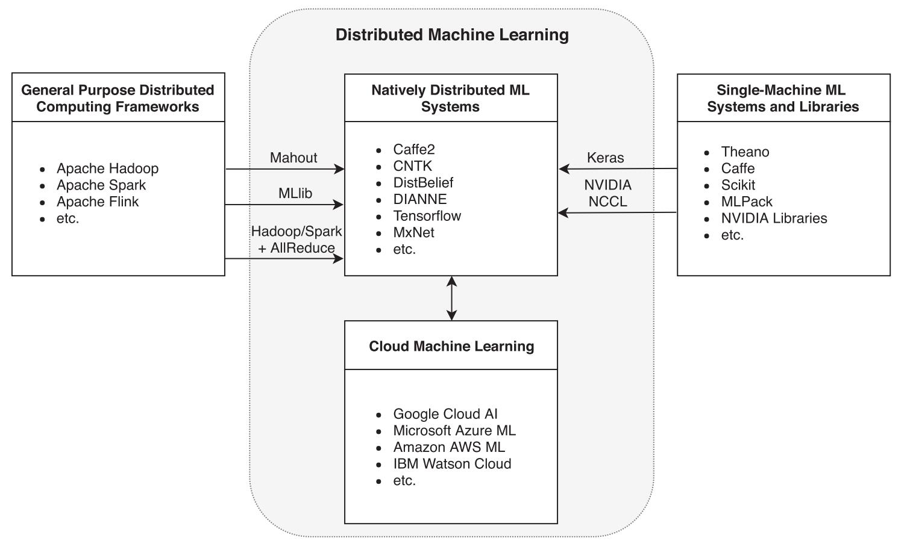

import ASP from './ASP.jpg'
import BAP_LB from './BAP_local_barrier.jpg'
import BAP from './BAP.jpg'
import BSP from './BSP.jpg'
import MLOverview from './ml_overview.jpg'
import ParallelTraing from './parallel_training.jpg'
import SSP from './SSP.jpg'
import Topologies from './topologies.jpg'
import WFBP from './WFBP.jpg'

# A Survey on Distributed Machine Learning

Verbraeken, Joost, et al. "A survey on distributed machine learning." _Acm computing surveys (csur)_ 53.2 (2020): 1-33.

## Abstract

The demand for artificial intelligence has grown significantly over the past decade, and this growth has been fueled by advances in machine learning techniques and the ability to leverage hardware acceleration. However, to increase the quality of predictions and render machine learning solutions feasible for more complex applications, a substantial amount of training data is required. Although small machine learning models can be trained with modest amounts of data, the input for training larger models such as neural networks grows exponentially with the number of parameters. **Since the demand for processing training data has outpaced the increase in computation power of computing machinery, there is a need for distributing the machine learning workload across multiple machines, and turning the centralized into a distributed system.** These distributed systems present new challenges: first and foremost, **the efficient parallelization of the training process and the creation of a coherent model**. This article provides an extensive overview of the current state-of-the-art in the field by outlining the challenges and opportunities of distributed machine learning over conventional (centralized) machine learning, discussing the techniques used for distributed machine learning, and providing an overview of the systems that are available.

## Machine Learning - A high-performance computing challenge?

在机器学习中大部分的计算都是对向量、矩阵、张量等的基础变换，而优化此类计算操作在高性能计算领域一直是一个比较活跃的研究方向，来自高性能计算领域的一些优化库（如 BLAS, MPI 等）也已被成功应用到了机器学习系统中。同时，近年来 AI+HPC 的相关研究也愈发活跃。

加速工作负载的两个基本路径：

- Scaling Up（在一台机器上增加更多的资源，纵向扩展）
- Scaling Out（在系统中加入更多的计算节点，横向扩展）

### Scaling Up

- 增加可编程 GPU 的数量是纵向扩展中最常见的方式：例如专为高度并行计算而设计的 Nvidia Tesla GPU 系列，当工作负载提供足够的并行度时，可以显著加速机器学习算法。
- 专用集成电路（Application Specific Integrated Circuits, ASICs）是另一个替代方案：
  - Google Tensor Processing Unit (TPU)：采用 MIMD 架构，能够有效执行不同的分支；通过 PCI Express 总线与服务器连接，具有高聚合带宽；与常规 CPU/GPU 相比，具有更强的处理能力以及更低的能耗。
  - DianNao: 中科院计算所团队研发的用于大规模神经网络的硬件加速器，引入了 NFU (Neuro-Functional Unit)，该单元将所有输入相乘，将结果相加，并且在执行完所有相加后以交错方式应用激活函数。与使用通用的 128 位 2GHz SIMD CPU 相比，DianNao 在性能和能耗上均有显著提升。
  - 从 DRAM 中访问神经元权重是一项昂贵的操作，Hinton 等人利用深度压缩技术，使得能够将权重放入 SRAM 中，并通过权重共享来加速所生成的稀疏矩阵的乘法运算，从而提高了吞吐量与能源效率。
  - 除此之外，还有许多专注于特定运算的设计，如采用 MIMD 架构的 Epiphany，其使用一个处理器阵列，每个处理器访问相同的内存，以加快浮点运算的执行速度。

### Scaling Out

原因：

- 在初始投资和维护方面，横向扩展相比升级一台“超级”计算机，设备成本更低。
- 容错能力，当单个节点发生故障时，系统仍可通过一定的调整策略来继续运行。
- 系统的 I/O 带宽更高，横向扩展可以通过在多台机器上有效地进行并行读写来减少 I/O 对性能的影响，这在数据密集型应用中是非常有利的。

挑战：

- 并非所有的机器学习算法都适用于分布式计算模型，因此只能将横向扩展应用于能够实现高度并行性的算法。

## A Reference Architecture For Distributed Machine Learning

### Distributed Training

- 数据并行（Data-Parallel）：训练数据一般被平均分布到各个工作节点中，随后工作节点将相同的模型算法应用于各自的数据中，最后进行聚合。该技术可用于对数据样本具有独立同分布假设的机器学习算法。
- 模型并行（Model-Parallel）：将单个模型的并行计算路径分配给多个节点，每个工作节点都拥有整个数据集的拷贝，随后对模型的不同部分进行并行训练。由于部分机器学习算法的模型参数难以拆分，因此该技术不能自动适用于所有机器学习算法，解决该问题的一种方法是训练相同或相似模型的不同实例，然后聚合所有训练模型的输出。

  

### Topologies

- Centralized Systems：采用严格的层次化聚合方法，聚合发生在一个单一的中心位置。实现简单，易于管理和监控，且中心化的结构通信效率较高，但是具有单点故障、中心节点通信瓶颈、不适用于大规模集群等问题。
- Trees：每个节点只需与其父节点和子节点通信，通信路径较短，延迟较低，清晰的层次结构也使得系统更易管理和扩展。但该结构具有单点故障（关键节点失效，导致系统难以运行）以及负载不均衡（一些节点可能会承担更多的负载而导致性能下降）等问题。
- Rings：每个节点只需与邻居节点进行通信，适用于系统无法有效支持广播通信或需要将通信开销保持在最低限度的情况。但是，传统的环形拓扑结构存在单点故障、节点间通信延迟较大等问题，此外，在节点数量较多的情况下，可能还会出现带宽瓶颈问题，影响系统的性能。
- Parameter Server：模型参数存储在参数服务器上，客户端以通信的方式对参数服务器中的模型参数进行读写（当工作节点的数据较为庞大时，可以将工作节点分成多个组，每个组内的工作节点先进行本地同步，然后再将同步后的梯度信息发送给参数服务器）。一个优点是在一个分片内的所有的模型参数都在一个全局共享的内存中，便于对模型进行检查，缺点是参数服务器处理来自各个工作节点的通信，可能会形成性能瓶颈。

  - Li, Mu, et al. "Parameter server for distributed machine learning." _Big learning NIPS workshop_. Vol. 6. No. 2. 2013.
  - Li, Mu, et al. "Scaling distributed machine learning with the parameter server." _11th \{USENIX} Symposium on Operating Systems Design and Implementation (\{OSDI} 14)_. 2014.

- Peer-to-Peer：每个节点都有自己的参数副本，节点之间直接相互通信，具有更高的扩展性和节点容错能力，但多个节点之间的同步操作开销较大。为减少通信开销，可以使用 SFB (Sufficient Factor Broadcasting) 方法进行同步，在该方法中参数矩阵被分解为两个足以重建更新矩阵的向量（Sufficient Factor），系统只广播这类轻量级的向量，节点接受到广播后在内部进行参数矩阵的重建。其他方法则对通信程度进行限制，仅在较少的同步点进行通信，同时允许各个模型在短暂时间内出现分歧。

  

### Communication

分布式策略的选择对训练模型所需的系统通信量有着直接影响。

#### Computation Time vs. Communication vs. Accuracy

对于复杂的机器学习问题，增加训练数据或模型参数，可能会带来准确率的提升，但是计算成本也随之增加。为了缩短计算时间，可以考虑采用分布式训练策略，但同时也会引入通信成本。因此，在实际的分布式训练系统部署时，要综合考虑多方面因素，寻求在可接受的计算时间内实现所需精度的最少通信量。

#### Bridging Computation and Communication

要安排和平衡工作量，需考虑三个问题：

- 确定哪些任务可以并行执行
- 确定任务的执行顺序
- 确保可用机器之间的负载均衡

可以使并行计算和通信交错执行的技术（在快速/正确的模型收敛与更快/更新的参数更新之间进行权衡）：

- 整体同步并行（Bulk Synchronous Parallel, BSP）

  - 计算任务被划分成一系列的超级步，每个超级步包括三个阶段：计算、通信和同步。计算阶段，每个处理器独立地执行计算任务。通信阶段，处理器之间交换消息。同步阶段，所有个处理器必须等待所有其他处理器到达屏障点，才能继续到下一个超级步。
  - BSP 可以保证输出结果的正确性，具有良好的可预测性和可控性，但其同步机制可能会引起性能瓶颈。
  - 扩展和应用：BSML, BSPLib, Apache Hama, Girph, Pregel......

    

- 过期同步并行（Stale Synchronous Parallel, SSP）

  - 处理器不必等待所有其他处理器完成超级步之后再继续执行计算任务，从而减少同步机制的开销，并提高计算效率。
  - 为了解决数据一致性问题，引入了“过期度”（staleness）的概念，即处理器可以使用其他处理器的过期数据，而不必等待最新的数据，各个处理器每次进行下一步时判断自己的步数与整个系统中最慢的节点快多少，如果达到一定阈值则进入等待状态。
  - SSP 的优点是可以减少同步和通信的开销，提高计算效率，且在过期度选择恰当的条件下保证的模型收敛性。然而，SSP 也存在一些缺点，例如处理器过期度大小的选择问题（过小，同步开销依然很大；过大，数据一致性受到影响）以及对处理器负载不平衡比较敏感（如果某些处理器的计算任务比其他处理器更重，那么在 SSP 模型中，这些处理器可能会使用过期数据，从而影响计算结果的正确性）。

    

- 近似同步并行（Approximate Synchronous Parallel, ASP）

  - ASP 基于一项重要发现，即每台工作节点对全局模型参数的绝大多数更新都是微不足道的。
  - 三个技术：
    - The Significance Filter：计算每次更新的重要性，如果重要性大于预设的阈值，则将其定义为重要更新。
    - ASP Selective Barrier：当参数服务器以高于广域网带宽支持的速率接收到重要更新时，参数服务器首先通过 ASP selective barrier 将这些重要更新的索引发送到其他数据中心。ASP selective barrier 的接收者将阻止其本地工作节点读取指定参数，直至接收到重要更新为止。
    - Mirror Clock：在不考虑广域网带宽或延迟的情况下，确保重要更新的同步。当每个参数服务器在一个时钟结束从其本地工作节点接收所有更新时，它会将其时钟报告给在其他数据中心负责相同参数的服务器。当服务器检测到它的时钟领先于共享相同参数的最慢的服务器一个预设的阈值时，该服务器阻止其本地工作节点读取其参数，直到最慢的镜像服务器赶上。
  - 在 ASP 算法中只要聚合的更新是不重要的，服务器就可以无限期地推迟同步，从而降低同步开销。但是该算法调试难度较大，很难选择定义哪些更新是重要的，哪些是不重要的参数。此外，ASP 无法保证所有数据中心的模型参数完全同步，可能会对模型精度产生一定的影响。

    

- 无障碍异步并行（Barrierless Asynchronous Parallel, BAP）

  - 通过使用分隔 logical supersteps 的 local barriers 来避免 global barriers。local barriers 不需要全局同步，它们对每个 worker 都是本地的，仅用作一些任务的暂停点，并决定是否需要 global barriers 来结束当前 superstep。
  - 虽然通过引入 local barriers 等方式减少了全局同步的开销，但可能会出现调试困难以及数据不一致等问题，影响模型收敛。

    
    

- 完全异步并行（Total Asynchronous Parallel, TAP）

  - 完全消除了工作节点之间的同步，所有工作节点都基于尽力而为的通信结果继续运行（即每个节点尽可能发送/接收更新），更进一步地减少了同步开销，但难以保证模型收敛。

#### Communication Strategies

- Bosen：该系统中的通信管理器通过带速率限制的带宽驱动通信以实现在不过度使用网络的情况下，每秒传送尽可能多的更新，充分利用带宽预算；通过选择适当的优先级策略来实现对更重要的模型更新进行优先排序，以提高每次迭代的 ML 进度。

- Wait-free Backpropagation（WFBP）：分布式深度学习训练过程的一次迭代可以表示为

  $$[C_t, S_t] = \left[f_t^1, \cdots, f_t^L, b_t^L, \cdots, b_t^1, o_t^L, \cdots, o_t^1, i_t^L, \cdots, i_t^1\right]$$

  其中$C_t$表示计算，$S_t$表示同步，$f$表示前向传播，$b$表示反向传播，$o$表示发送本地更新，$i$表示读取远程发送来的更新参数，$L$为网络层数。WFBP 基于两个独立性，来使计算和同步进行流水线并行：

  - $o^l_t$独立于$$b^i_t (i<l)$$，无需阻塞$$b^i_t (i<l)$$的执行
  - 同理，$i^l_t$也无需阻塞$$b^i_t (i<l)$$的执行

  WFBP 对于训练具有参数集中在上层（FC 层）但计算集中在下层（CONV 层）的深度学习模型最有益，这是因为它可以将顶层（90%的通信时间）的通信与底层（90%的计算时间）的计算重叠。

  

- Hybrid Communication（HybComm）：虽然 WFBP 重叠了通信和计算，但它并没有减少通信开销。为了解决这个问题，HybComm 被提出，它同时考虑了深度学习模型的数学属性和计算集群的结构，结合了 PS 和 SFB 的优点。该策略的想法来源于两点：

  - 同步操作之间彼此独立，可以对不同的同步操作设计不同的通信方法
  - 深度学习模型的结构在训练前已经给定，可以针对不同结构设计不同的通信方法

  HybComm 综合考虑参数服务器和工作节点的个数、参数矩阵的大小、Batch 大小来优化通信开销。例如，对于参数量较大的 FC 层，可以通过 SFB 的方式对其参数矩阵进行分解来减小通信开销，对于 CONV 层，其参数量较小，且更新是不可分解和稀疏的，可以直接传输。

- Reference:
  - Wei, Jinliang, et al. "Managed communication and consistency for fast data-parallel iterative analytics." _Proceedings of the Sixth ACM Symposium on Cloud Computing_. 2015.
  - Zhang, Hao, et al. "Poseidon: An Efficient Communication Architecture for Distributed Deep Learning on GPU Clusters." _USENIX Annual Technical Conference_. Vol. 1. No. 1. 2017.

## The Distributed Machine Learning Ecosystem

### General Purpose Distributed Computing Frameworks

#### Storage

现有框架的存储层通常基于 Google File System (GFS) 或类似的实现，GFS 将上传到集群的数据分割成块，存储在分块服务器（chunk servers）上，并且以数据冗余的方式保证数据在机器故障时仍可使用。用户可以通过主服务器来访问分块服务器上的数据，主服务器作为名称节点，提供每个分块的位置。Hadoop 的存储层 HDFS（Hadoop File System）采用了 GFS 架构，HDFS 起初基本上是 GFS 设计的副本，只是在名称上存在差异。

#### Compute

（该部分内容来自 ChatGPT）

- MapReduce
  - 由 Google 开发的用于在分布式环境下处理数据的框架（和底层架构）。
  - Map Phase：将输入数据切分成多个小数据块，然后对每个小数据块执行相同的 Map 函数进行处理，输出键值对 \<key, value>。
  - Shuffle Phase：将 Map 阶段输出的键值对根据键值进行分组和排序，并将具有相同键的键值对传递给同一个 Reduce 函数进行处理，以便 Reduce 阶段可以更加高效地处理数据。
  - Reduce Phase：对 Shuffle 阶段输出的分组数据进行汇总和处理。Reduce 函数的输入数据通常是某个 key 的所有 value，Reduce 函数会对所有的 value 进行汇总和处理，最终输出一个或多个键值对。
- Hadoop
  - 最早的分布式计算框架之一，其主要目的是为了解决海量数据的存储和处理问题。
  - Hadoop 的核心组件包括 HDFS 和 MapReduce。
  - Hadoop 的主要应用场景是离线批处理。它的 MapReduce 模型适用于需要对整个数据集进行计算的场景，而且能够扩展到数百台甚至数千台机器。Hadoop 适合存储和处理大型静态数据集，例如 Web 日志、社交媒体数据、电影评论等等。由于 Hadoop 是一个基于磁盘的存储和计算框架，所以它在处理批处理数据时非常高效。
- Spark
  - 一个快速、通用、可扩展的大数据处理框架，支持多种编程语言，包括 Java、Scala、Python 和 R 等，可以用于批处理、交互式数据探索和即席查询（如数据仓库和 BI 分析等）、实时流处理等场景。
  - 与 Hadoop 不同的是，Spark 的计算模型是基于内存的，并且支持缓存和迭代计算。
  - 核心组件包括 Spark Core、Spark SQL、Spark Streaming、MLlib 和 GraphX 等。
    - Spark Core 是 Spark 的核心组件，提供了基本的内存计算功能和任务调度等功能；
    - Spark SQL 是一个基于 SQL 的查询引擎，支持 SQL 查询、DataFrame 和 Dataset 等数据结构
    - Spark Streaming 支持实时数据流处理，可以处理流式数据，并将其转换为批处理数据进行分析
    - MLlib 是 Spark 提供的机器学习库，包括常用的分类、回归、聚类等算法
    - GraphX 是 Spark 提供的图计算库，支持构建和处理大规模图数据集。
- Flink
  - 一个分布式流式处理框架，支持高效、可扩展的数据流处理。
  - 核心组件包括 Flink Core、DataStream API、Table API 和 Flink SQL 等。
    - Flink Core 提供了基本的流式处理功能和任务调度等功能；
    - DataStream API 支持流式数据处理，可以对无限的流数据进行连续计算；
    - Table API 和 Flink SQL 则提供了类 SQL 的查询接口，支持 SQL 查询、关系型操作和流和批的混合计算等。
    - Flink 还支持状态管理和容错机制，保证了数据流处理的准确性和可靠性。
  - 主要应用场景是实时流处理和数据分析，其支持有界和无界数据流处理，能够处理连续的数据流和实时的事件数据，并提供了比 Hadoop 更快的流处理能力，适合于需要实时计算和处理的场景，例如实时风控、欺诈检测、在线推荐和实时日志分析等。

### Natively Distributed Machine Learning System

#### Parallel Synchronous SGD

- Baidu Ring AllReduce：通过将机器集群构成为一个环（每个节点只有两个邻居）并级联归约操作，以减少通信量，已集成到 Tensorflow 中，作为基于内置参数服务器的方法的替代方案。该方法在默认情况下缺乏容错性，因为环中没有一个节点可以被遗漏，这可以用冗余来抵消（以效率为代价）。然而，如果不这样做，那么该方法的可扩展性就受到所有节点可用的概率的限制。此外，当环中的节点过多时，会出现通信路径变长、通信延迟增加等问题，限制系统的扩展性。
- Horovod：采取了与百度非常相似的方法，为 Tensorflow 增加了一层基于 AllReduce 的 MPI 训练，一个区别是其使用 NCCL 来提高在 NVIDIA GPU 上训练时的效率。
- Caffe2：主要由 Facebook 维护，再次通过 AllReduce 算法进行分布式计算，使用 NCCL 在单个主机上的 GPU 之间进行通信，在主机之间使用基于 Facebook 的 Gloo 库的自定义代码来抽象出不同的互连方式。Facebook 使用 Ring AllReduce（提供更好的带宽和并行性保证），还使用递归的对半和加倍（一种分治方法，提供更好的延迟保证），提高了在延迟受限的情况下（例如对于小缓冲区大小和大服务器数量的情况）的性能。
- CNTK or The Microsoft Cognitive Toolkit：提供多种数据并行分布模式，多数使用 Ring AllReduce 策略，在线性可扩展性与容错性之间做出相同的权衡。

#### Parallel Stale-Synchronous SGD

Petuum 旨在为大数据和大模型上的任何类型的机器学习提供通用平台，支持数据和模型并行。Petuum 利用 ML 的容错性、动态结构依赖性和非均匀收敛性，在大数据集和模型上实现良好的可扩展性。这与例如 Spark 专注于容错和恢复的方式不同。该平台使用过期同步来利用机器学习对错误的固有容忍度，因为少量的过期只会对收敛产生轻微影响。采用动态调度策略来利用动态结构依赖性，有助于最小化并行化误差和同步成本。最后，未收敛参数优先级利用非均匀收敛来减少已接近最优状态的参数的计算成本。

#### Parallel Asynchronous SGD and Parameter Servers

异步方法的实现往往更复杂，跟踪和调试运行时行为也更难，但是其可以缓解在故障率高或性能不一致的集群中出现的许多问题。

- DistBelief：大规模分布式机器学习框架的早期应用实现之一，由 Google 开发。为实现高效的模型并行，引入了计算图，每台机器执行计算图中部分节点的训练，只有在节点的输出被用作另一台机器训练的节点的输入时才需要通信。计算图划分的策略受模型架构的影响很大，例如，局部连接的模型更适合于模型并行，因为跨区通信有限而完全连接的模型有更多的跨区依赖，更难通过 DistBelief 进行有效地分发。为了进一步并行化模型训练，DistBelief 在模型并行的基础上继续应用数据并行，其支持两种不同的数据并行方法：
  - Downpour SGD：每个模型副本每隔$n_{fetch}$步从参数服务器中获取模型参数并进行更新，每隔$n_{push}$步将参数梯度推送到参数服务器，从而实现更低的通信开销。Downpour SGD 比 SGD 更具容错性，因为即使某些模型副本离线，也可以继续训练，但是由于参数不同步，优化过程具有不可预测性。
  - Distributed L-BGFS：利用外部协调器进程在模型副本之间分配训练工作，以及在参数服务器分片之间对参数进行一些操作。
- DIANNE（DIstributed Artificial Neural Networks）：一个基于 Java 的分布式深度学习框架，使用 Torch native backend 来执行必要的计算，使用基于模块化 OSGi 的分布式框架，允许在基础设施的不同节点上执行深度学习系统的不同组件，神经网络的每个基本构建块都可以部署在特定节点上，从而实现模型并行性。
- Tensorflow：DistBelief 的升级版，为了取代 Google 内部的 DistBelief 而开发，其借用了 DistBelief 的计算图和参数服务器等概念，还对参数服务器模型进行了后续的优化，例如对训练卷积神经网络的优化以及关于一致性模型和容错的创新。与 DistBelief 不同，TensorFlow 是作为开源软件提供的。
- MXNet：使用了与 Tensorflow 非常相似的策略：模型表示为数据流图，模型被表示为数据流图，在硬件上执行并使用参数服务器协调。MXNet 还支持命令式定义数据流图作为对 n 维数组的操作，简化了某些类型网络的实现。
- DMTK or the Distributed Machine Learning Toolkit：可以与 CNTK 一起使用以启用异步 SGD。

#### Parallel Hybrid-Synchronous SGD

- MXNet-MPI：结合了异步（参数服务器）和同步（MPI），将工作节点集中到一起，在内部通过 AllReduce 的 MPI 应用同步 SGD，具有同步 MPI 方法易于线性扩展和异步参数服务器方法容错的优点。

#### Machine Learning in the Cloud

一些云服务提供商已将机器学习作为云服务的一部分，大多数在其云中提供多种执行机器学习任务的选项，从 IaaS 级别的服务（预安装了 ML 软件的 VM 实例）到 SaaS 级别的解决方案（模型即服务），提供的技术大多是标准的分布式机器学习系统和库。例如，Google 的 Cloud Machine Learning Engine 提供了对 TensorFlow 的支持，并提供 TPU 实例。Microsoft Azure Machine Learning 允许通过 Azure Kubernetes、批处理服务或使用 CNTK VM 部署模型。作为 Google TPU 的竞争对手，Azure 通过 FPGA 支持加速 ML 应用。Amazon AWS 推出了 SageMaker，这是一个在云中构建和训练机器学习模型的托管服务，包括对 TensorFlow、MXNet 和 Spark 的支持。IBM 将他们的云机器学习服务打包在 Watson 品牌下，服务包括 Jupyter notebooks、Tensorflow 和 Keras。基于云的交付模型变得越来越重要，因为它减轻了设计智能应用程序以利用机器学习技术的门槛，云不仅是分布式机器学习技术的消费者，而且还在推动新系统和方法的开发回到生态系统以处理大规模部署。

## Conclusions and Current Challenges

分布式机器学习是一个蓬勃发展的生态系统，在架构、算法、性能和效率方面有着各不相同的解决方案。 首先必须克服一些基本挑战才能使分布式机器学习可行，例如找到有效并行处理数据的机制，同时将结果组合到一个单一的连贯模型中。现在已经有工业级的系统可用，并且考虑到人们对使用机器学习解决更复杂问题的渴望不断增长，分布式机器学习越来越成为常态，单机解决方案则成为例外，类似于过去十年中数据处理的发展趋势。然而，仍然存在许多对分布式机器学习的长期成功至关重要的开放挑战：

### Performance

经常看到的权衡是通过添加额外资源以 total aggregate processing time（即效率的降低）为代价来减少 wall-clock time。GPU 的分布式使用，如在 Tensorflow 中，具有较好的性能，但通常仍然表现出低于 75% 的效率，在基于同步 SGD 的框架的背景下，性能问题更加严重，未来可以从工作负载优化和架构设计等层面来研究如何提高系统的性能和可扩展性。

### Fault Tolerance

基于 AllReduce 的同步方法缺乏一定的容错性，单个计算节点的故障会影响整个训练过程。一些异步方法的实现，明确容忍掉队/故障节点，具有容错能力，但是可能会影响模型的收敛。

### Privacy

基于参数服务器的系统在隐私环境中很有用，因为模型的训练可以与训练结果分开。联邦学习系统可以部署在多方共同学习准确的深度神经网络的地方，通过应用差分隐私保护各自数据的隐私。此外，还可以将统计噪声引入训练数据的每个子集，以使其敏感特征无法被其他方识别。

### Portability

随着硬件平台的逐渐多样化，模型的可移植性变得越来越重要，目前存在许多用于创建和训练神经网络的框架，模型的部署受制于不同框架的网络存储格式，实现可移植性的第一步是制定一些独立于框架的规范来定义模型和计算图，如 Open Neural Network Exchange (ONNX) format, Core ML format 等。
