Stanford Seminar - Interaction-Centric AI by Juho Kim of KAIST (December 9, 2022)

- https://www.youtube.com/watch?v=Wr0zPcm5N2g&t=2649s

## Abstract

"Remarkable model performance makes news headlines and compelling demos, but these advances rarely translate to a lasting impact on real-world users. A common anti-pattern is overlooking the dynamic, complex, and unexpected ways humans interact with AI, which in turn limits the adoption and usage of AI in practical contexts. To address this, I argue that human-AI interaction should be considered a first-class object in designing AI applications. In this talk, I present a few novel interactive systems that use AI to support complex real-life tasks. I discuss tensions and solutions in designing human-AI interaction, and critically reflect on my own research to share hard-earned design lessons. Factors such as accuracy disparity between user groups, user motivation, social dynamics, and sustainable engagement often play a crucial role in determining the user experience of AI, even more so than model accuracy. My call to action is that we need to establish robust building blocks for Interaction-Centric AI, a systematic approach to designing and engineering human-AI interaction that complements and overcomes the limitations of model- and data-centric views."

## Paradigms for AI dev

- Model-Centric AI: design a good model with high accuracy, evaluate it against unseen examples for its generalizability and compare with other models through benchmarks.
- Data-Centric AI: focus on acquiring quality data and setting the data pipeline in a way that can help the model perform well in different contexts.
- Interaction-Centric AI: improve the user experience by building usable applications and focusing the attention to the Human-AI interaction.

## AI Applications face an interaction challenge

演讲人举了一个 AI 绘图的例子引出了目前 AI 应用所面临的交互挑战：系统无法按照用户真实的意图运行

为了让 AI 绘制一个“正在用筷子吃面条的女孩”，用户通过不断调整 prompt 才得到了令自己满意的结果，整个过程花费了将近两个小时。虽然现有的 AI 绘图模型以 Text-to-Image 的方式运行，提供了从自然语言到生成图像的直观转换也支持一些参数调整相关的交互，但是模型的输出结果难以预测且缺乏特定的反馈，用户无法确定某个特定的单词会对生成结果产生怎样的影响，因此系统需要用户进行反复尝试来对模型的输出进行调整，与人类画家相比，无法通过对话来准确地获取用户意图。

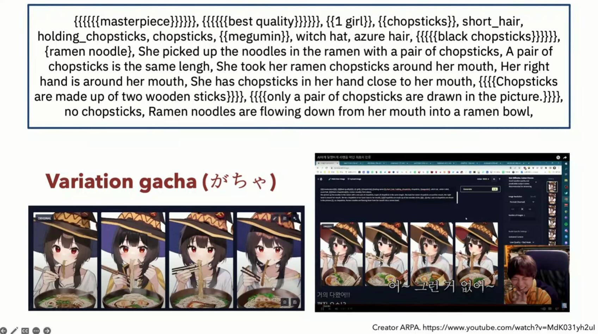

为了缩小模型与用户之间的 Gap，研究人员们提出了 Alignment Problem，即研究如何将模型的表现与用户的意图对齐，例如 OpenAI 在 instructGPT 中所引入的人类反馈强化学习：

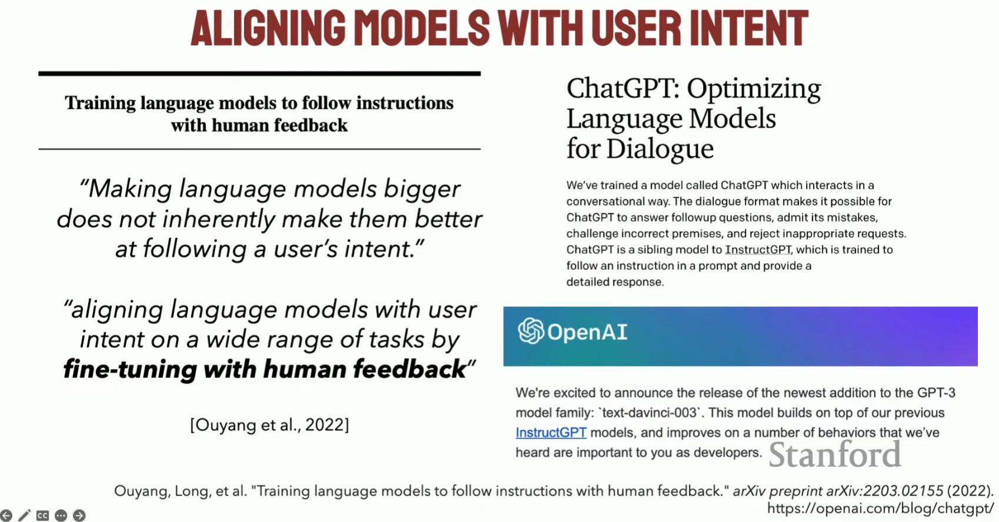

### Gulf of execution & evaluation

用户期望了解系统的执行方式并且拥有更多的控制权；此外，用户期望模型输出的结果可解释、可被人理解......

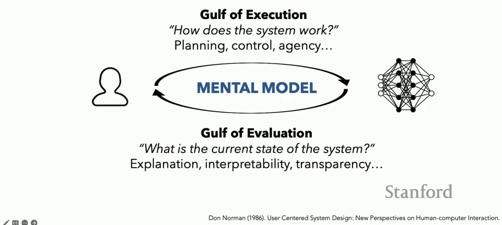

我们需要更加系统以及可持续的方法来设计并研发 Interaction-Centric AI：

- HCI 相关研究可以贡献更加通用的构建块和交互界面等
- AI 相关研究可以重新思考模型的结构、衡量指标、研究流程等

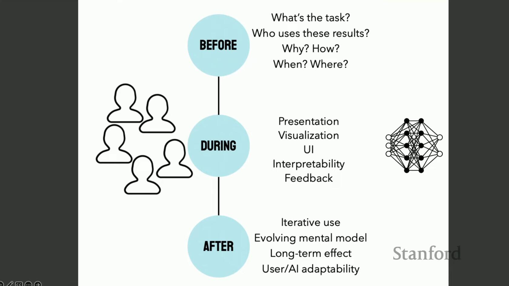

## Four human-AI interaction challenges

### Challenge 1: Bridging the accuracy gap

不同的用户群体从同一个 AI 模型中获得了不成比例的结果是一个很常见的问题：

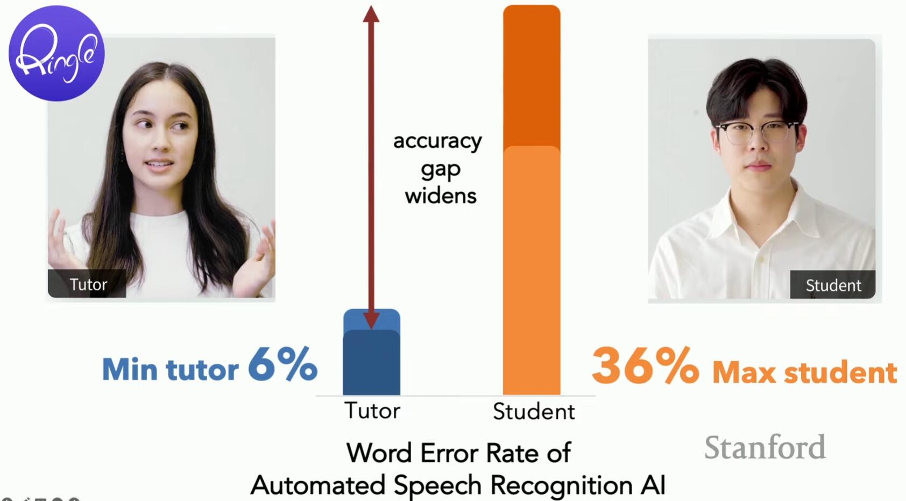

Model-Centric AI 专注于提高模型在某些数据集上的准确率，由于一些类别的数据很少或者识别更加困难，模型在这些类别上的表现对整体的准确率影响不大，因此 Model-Centric AI 往往会加大不同群体之间准确率的差距：

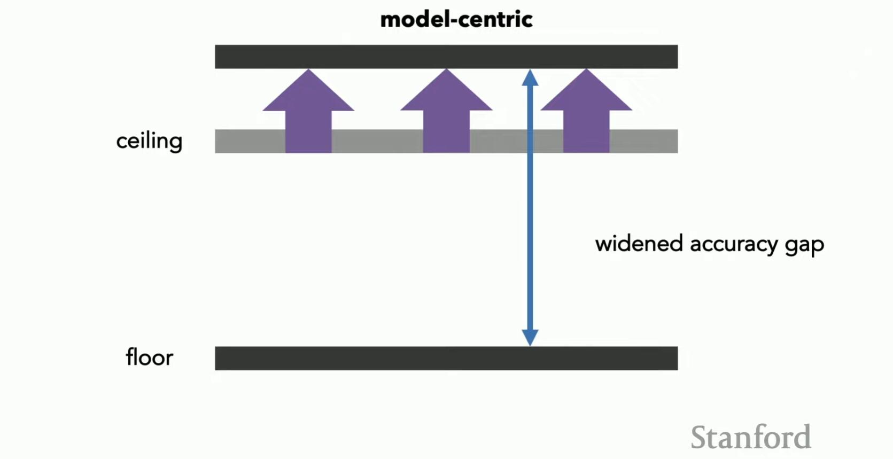

Interaction-Centric AI 在设计的过程中首先要定位什么是系统中最重要的问题，如果我们把重点放在缩小不同用户群体之间的体验差异上，那么系统的衡量指标就不仅仅是整体的准确率，还要综合考虑不同用户群体的评价：

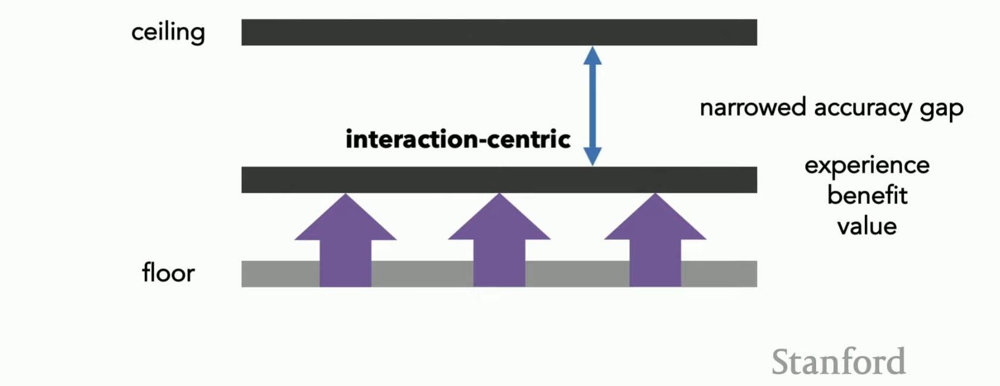

### Challenge 2: Incentivizing users to work with AI

#### AXIS: Generating Explanations at Scale with Learnersourcing and Machine Learning

演讲者以 AXIS 系统为例，介绍了 Human 与 AI 之间如何进行共同学习：

在线教育应用中，用户可以找到很多问题和答案，但找到好的解释却非常困难，而且生成高质量解释的成本较高，为了尝试解决这个问题，AXIS 系统的流程如下：

1. 系统发送问题给用户
2. 用户求解问题并提交答案
3. 系统将解释返回给用户
4. 用户阅读解释并对其进行打分
5. 用户提交自己的解题思考过程（可选）
6. 系统收集用户返回的评分以及解释，动态调整后续的输出

- Multi-armed bandit formulation：

  - 当一个新的解释作为进入系统时，一个新的 arm 被添加到系统中，系统需要确定动态策略，以便为下一个学习者提供更加有效的解释
  - 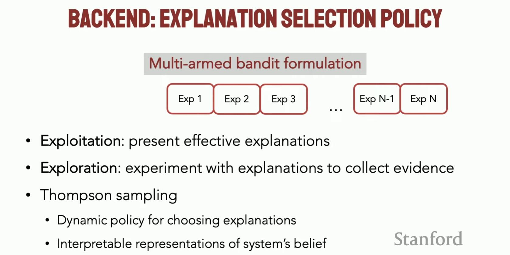

  - 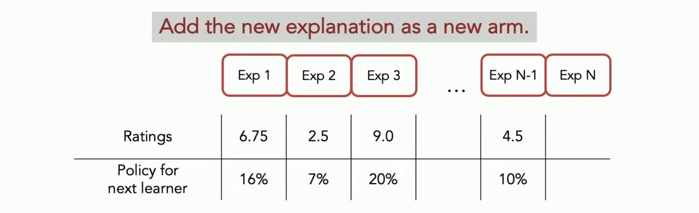

  - 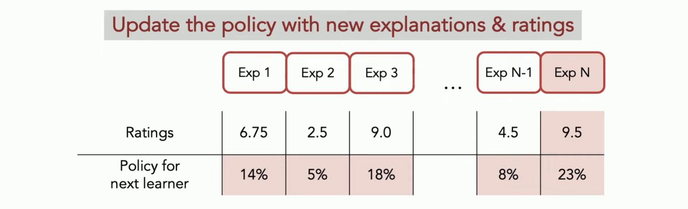

#### Model-Centric vs Intercation-Centric

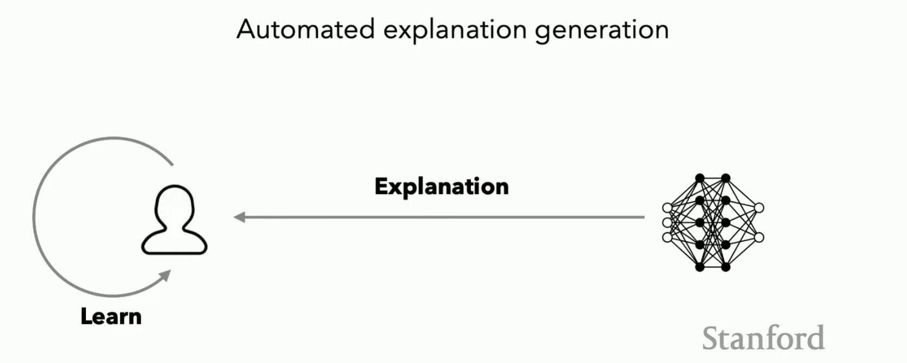

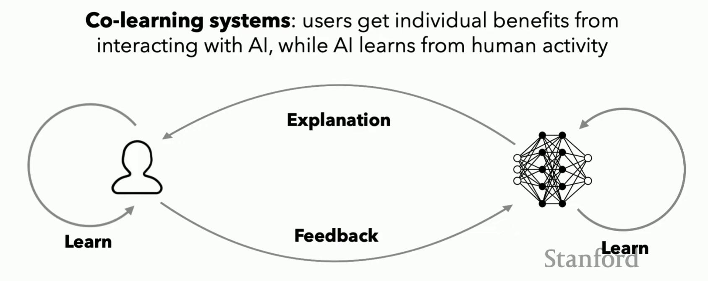

#### Other Learnersourcing works:

- Weir S, Kim J, Gajos K Z, et al. Learnersourcing subgoal labels for how-to videos[C]//Proceedings of the 18th ACM conference on computer supported cooperative work & social computing. 2015: 405-416.
- Liu C, Kim J, Wang H C. ConceptScape: Collaborative concept mapping for video learning[C]//Proceedings of the 2018 CHI conference on human factors in computing systems. 2018: 1-12.
- Choi K, Shin H, Xia M, et al. AlgoSolve: Supporting Subgoal Learning in Algorithmic Problem-Solving with Learnersourced Microtasks[C]//Proceedings of the 2022 CHI Conference on Human Factors in Computing Systems. 2022: 1-16.
- Glassman E L, Lin A, Cai C J, et al. Learnersourcing personalized hints[C]//Proceedings of the 19th ACM conference on computer-supported cooperative work & social computing. 2016: 1626-1636.
- Singh A, Brooks C, Lin Y, et al. What's In It for the Learners? Evidence from a Randomized Field Experiment on Learnersourcing Questions in a MOOC[C]//Proceedings of the Eighth ACM Conference on Learning@ Scale. 2021: 221-233.
- Abdi S, Khosravi H, Sadiq S, et al. Evaluating the quality of learning resources: A learnersourcing approach[J]. IEEE Transactions on Learning Technologies, 2021, 14(1): 81-92.

### Challenge 3: Considering social dynamics

除了单个用户与单个 AI 之间的交互外，现实生活中的交互会复杂很多，并且会有多种配置，如何考虑这些 social dynamics 又是一大挑战。

#### SolutionChat: Real-time moderator support for chat-based structured discussion (CHI 2020)

在线聊天是讨论社区问题的新兴渠道，社区通常会指派专门的版主来维持结构化讨论并增强解决问题的体验。然而，由于在线聊天的同步性质，版主在讨论阶段管理、意见总结和建立共识支持等任务中面临着很高的管理开销。SolutionChat 是一个在线聊天平台，旨在支持在主持人协助下进行结构化讨论。借助 SolutionChat，我们设想未经培训的版主可以以较低的开销应用结构化讨论，同时保持积极的管理和教学支持，从而有助于支持结构化讨论，让更多群体和社区参与到基于聊天的讨论中。

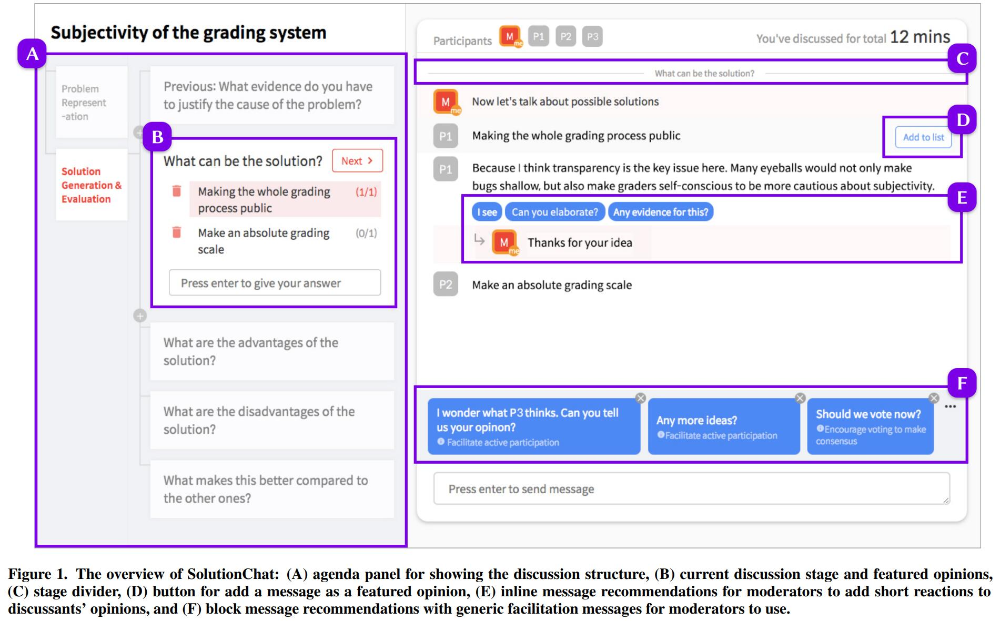

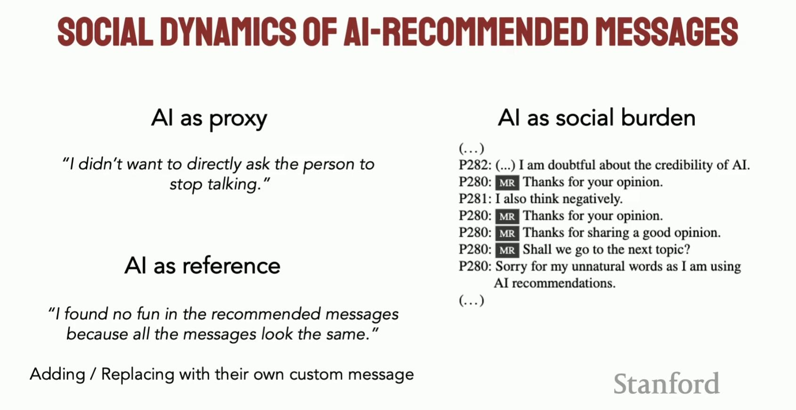

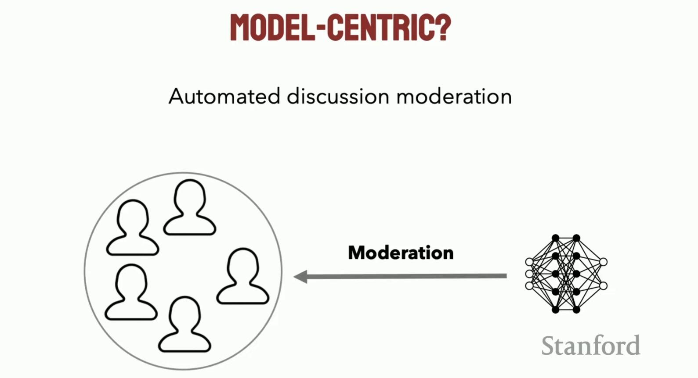

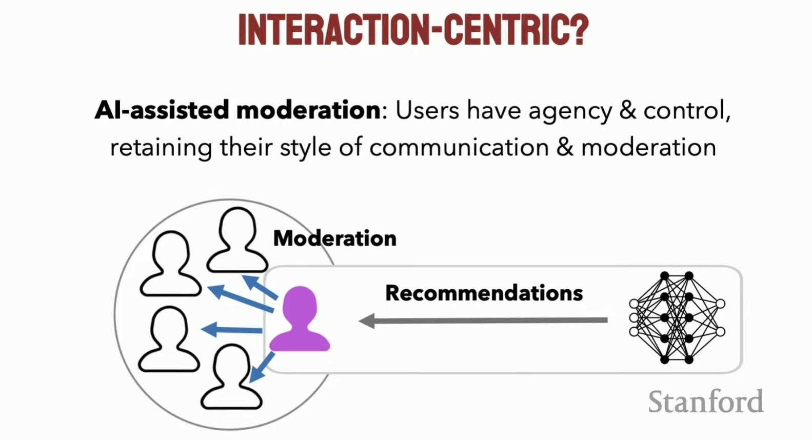

### Challenge 4: Supporting sustainable engagement

随着时间的推移，用户对系统的反应可能会改变，AI 的实际工作方式可能也会改变，所以我们需要更仔细地考虑时间维度上的交互问题。

#### Stylete: Styling the Web with Natural Language (CHI 2022)

对于没有前端开发技能的用户来说，Stylete 可以很好地帮助用户实现个人需求，但是随着用户技能的增长，如下图所示，自然语言交互式的样式修改无法满足更细粒度的样式修改需求，用户更倾向于自己动手来完成目标，Stylete 的满意度开始下降。

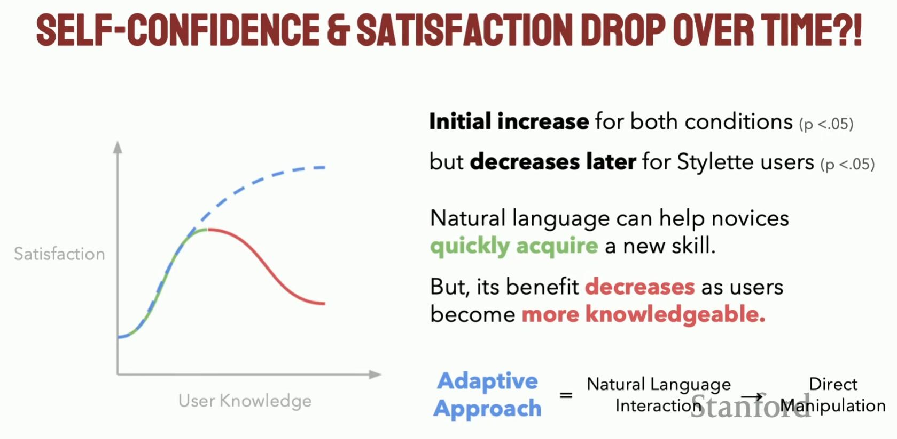

用户的专业知识和学习能力对于人机交互系统的设计非常重要，随着用户领域知识的增多，他们可能需要更加高级的交互方式或者自己直接操纵，充分考虑时间维度可以更有力地支持可持续的用户参与。

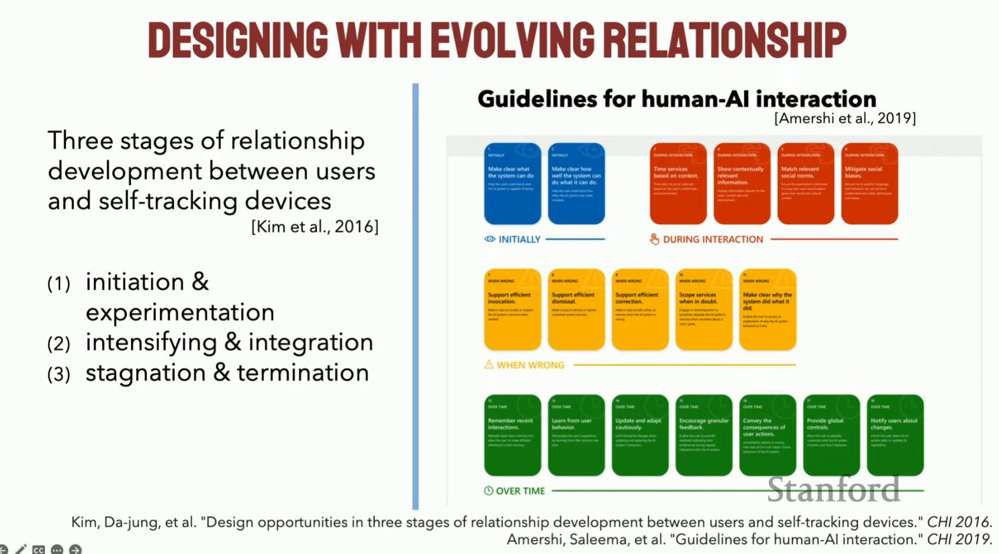

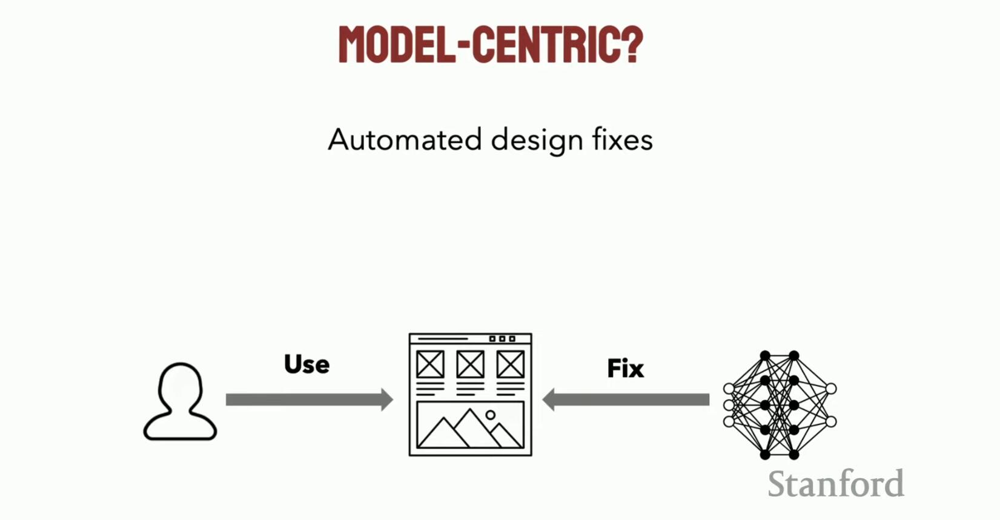

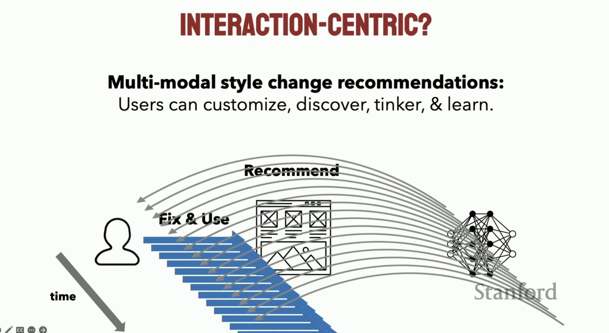

## Moving Forward

### Building blocks & interface affordances

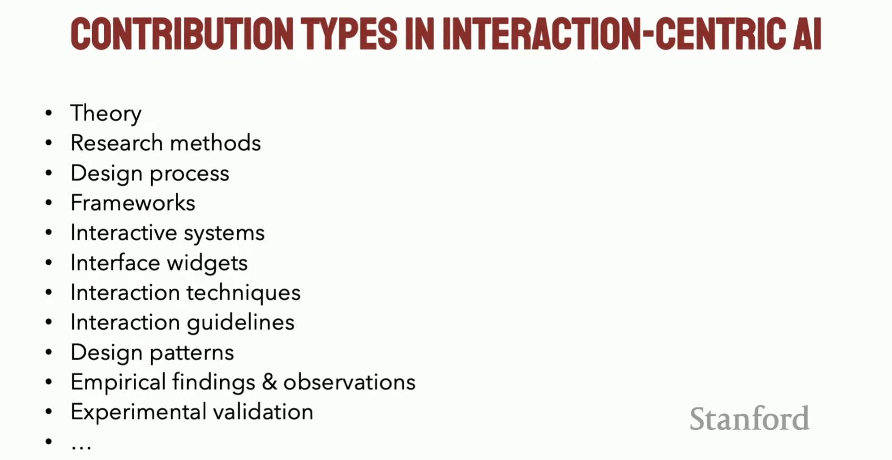

#### Some recent works

- Chung J J Y, Kim W, Yoo K M, et al. TaleBrush: sketching stories with generative pretrained language models[C]//Proceedings of the 2022 CHI Conference on Human Factors in Computing Systems. 2022: 1-19.
- Wu T, Terry M, Cai C J. Ai chains: Transparent and controllable human-ai interaction by chaining large language model prompts[C]//Proceedings of the 2022 CHI Conference on Human Factors in Computing Systems. 2022: 1-22.
- Kim T S, Sarkar A, Lee Y, et al. LMCanvas: Object-Oriented Interaction to Personalize Large Language Model-Powered Writing Environments[J]. arXiv preprint arXiv:2303.15125, 2023.
- 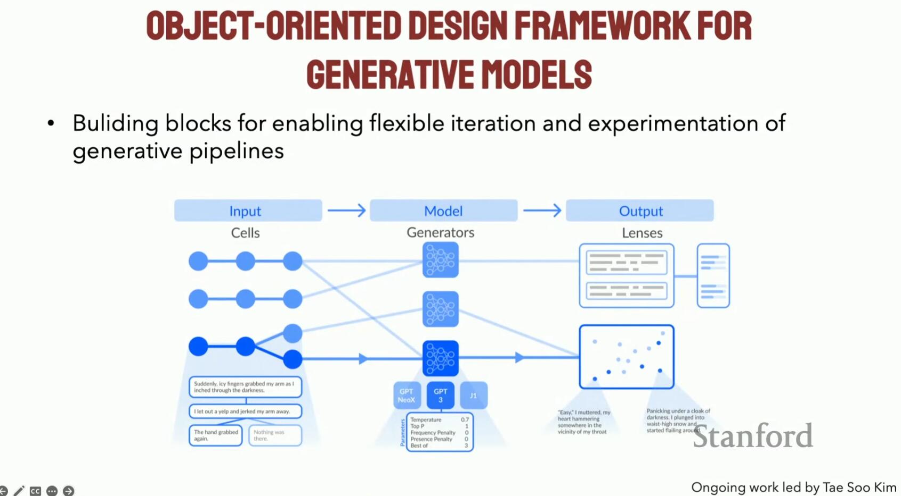

### Collaboration on metrics, human input design & design process

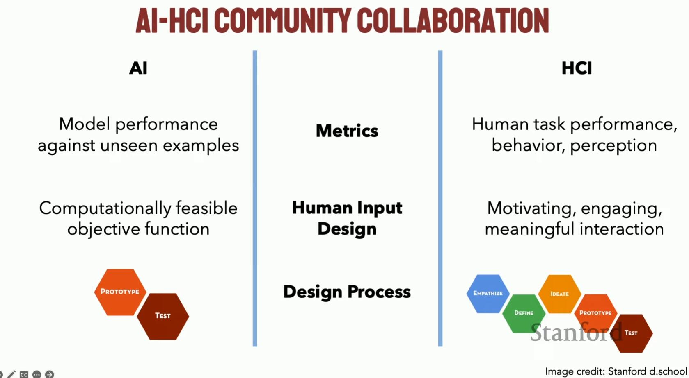

## Q&A

Q：如何将人类反馈与目标函数联系起来？用户交互的成本非常高昂，为了收集标注数据然后来调整模型。但是这往往并不会带来太多的收益，所以经常会退回到自监督，或者就像您在对齐中所谈到的那样，他们训练一个强化学习模型来模仿人类，然后让它自由运行。在我看来，似乎除非有一些策略，我们能够创建人类代理并将其连接到目标函数、损失函数等，否则就需要采取另一种方式，直接让人类反馈以某种形式大规模地被直接用于模型中。请您就这两种立场之一发表观点。

A：我认为两种方法都会流行，但我更喜欢后者，我认为这更具有前途和可持续性。例如，我真正感兴趣的是人和机器之间的协同学习和反馈循环，因为即使超级 AI 出现，它可以提供超级准确的解释，但自我解释仍然是有意义的，因为那是人们学习的方式。我们不能仅仅试图去找这些兼容的机制，而是需要真正去寻找它们，以便让人类在这个过程中能够获得好处和激励，去做他们真正擅长的事情，以及对他们有帮助的事情，而不是仅仅为了帮助机器学习系统或为了得到报酬而支持系统。同时，机器学习系统也可以从这些有意义的反馈中受益，以进一步提高模型的性能和效果。在系统方面，我认为在我呈现的这个系统中（AXIS），人们的评分数据可以几乎直接输入到 RL 代理程序的反馈中，这是非常好的技术解决方案，使其成为有意义的反馈。我认为这只是其中一个例子，可以用于不同的上下文中，我们需要更深入地研究并考虑这种方法是否有更多可推广的机制。

Q：这假设你有一个大的用户群体，可以直接从中获取学习者。如果我处于项目的早期阶段，还没有用户，那么您会推荐其他策略吗？

A：比如说在同样的那个系统中，我们的做法是将由教师生成的解释作为初始种子插入。我也想象了一下，我们可以插入由 AI 生成的解释，以避免冷启动问题，很有趣的是，我们可以看到在同一个系统中，由人工生成的解释、由 AI 生成的解释和由学习者生成的解释之间进行竞争，直到系统最终专注于最符合学习者需求的解释。

Q：这是一个由两部分组成的问题。回到你提到的第三个挑战，其中有一条关于 AI 作为代理的注释，人们使用 AI 来表达他们可能想说的观点并且可以不让自己露面。那么问题的第一部分是，在这种情况下，这些人想让它听起来像是他们自己说的话吗？还是他们想让它听起来更加像 AI？第二部分问题是，你认为是否存在更多这样的情况，即我们可能不希望 AI 感觉过于亲切，而是希望交互感觉稍微有点机械或不自然？

A：这是一个非常好的问题，我认为这些是略有不同的用例，但两者都很有价值。在更加以模型为中心的方法中，我们也试图着重于尝试创建更加人性化的信息，这在某些情况下可能是有效的，但正如你所说，这可能并不是用户真正想要的，因为在代理的情况下，你可能并不希望它听起来过于个性化，因为在那种情况下，更加标准化的信息可能实际上更有效。反之亦然，所以我认为，能够识别人们的不同需求和期望，并能够比较自如地支持它们，是我们所做的非常有趣的观察。我认为，未来的发展方向之一是，这种更加个性化的信息生成技术可能是一个有趣的技术，可以潜在地被整合使用，但这并不能解决所有问题，因为即使使用完美的个性化样式转换，仍然会存在其他类型的需求得不到支持。因此，我们需要在不同情况下灵活地支持各种需求，而不是一概而论地采用某种方法。

Q：解释这些内容时，我一直在想你所描述的和我们在使用这些新的深度网络和模型时所遇到的挑战，与人们过去与搜索引擎的互动方式类似。在一开始，人们不太擅长弄清楚如何查询搜索引擎，随着时间的推移，我们变得更擅长创建搜索引擎，而搜索引擎也变得更擅长理解如何解释用户的查询。你是否看到了其中的相似之处？是否存在某些与我们所面临的新模型挑战非常独特的东西，还是只是我们还没有足够的时间以某种方式进行适应？

A：是的，非常好。我认为这是一个反复出现的主题。随着这些新技术的出现，最初人们会遇到困难，并需要通过试错和大量失败的尝试来学习如何使用它。这就是我们在 ChatGPT 中看到的情况，许多人正在尝试各种方法，报告成功和失败的案例。因此，我认为在某些方面存在相似之处。更独特的是，由于这些模型是黑盒的、复杂、不可预测的，我认为它们会让人们更加困惑，而且存在一个问题，即这真的是一个人类学习问题吗？如果人们花更多的时间，他们是否真的能够轻松地创建出他们喜欢的东西？可能不会，这就是为什么我认为我们需要在模型方面思考更可交互和可学习的方式来设计这些模型，同时从人机交互的角度出发，思考可以增加这些模型可理解性和可用性的交互机制。

## Note

以上内容为本人对该研讨会内容的理解与总结，仅作个人学习与交流使用！
