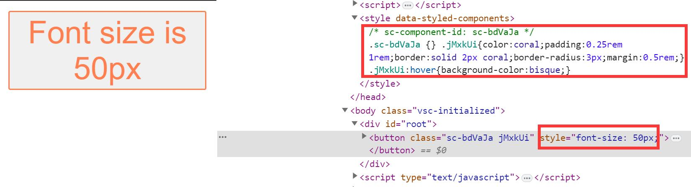

本文是对 [How styled-components works: A deep dive under the hood ](https://medium.com/styled-components/how-styled-components-works-618a69970421) 的梳理与总结

## 语法解析

以创建一个简单的样式化的 button 为例，其代码为：

```javascript
const Button = styled.button`
  color: coral;
  padding: 0.25rem 1rem;
  border: solid 2px coral;
  border-radius: 3px;
  margin: 0.5rem;
  font-size: 1rem;
`
```

其中 styled.button 其实是 styled('button') 的一个语法糖，实际调用情况为：

```javascript
const Button = styled('button')([
  'color: coral;' +
    'padding: 0.25rem 1rem;' +
    'border: solid 2px coral;' +
    'border-radius: 3px;' +
    'margin: 0.5rem;' +
    'font-size: 1rem;',
])
```

从这里可以看出 styled 其实是一个组件工厂函数，其会根据传入的原组件以及相关参数，创建一个新的用于后续样式化的组件。

## 一个极简的 styled 实现

这里为了实现方便，采用的是将解析之后的样式直接作为内联样式插入组件。

```javascript
const myStyled =
  (TargetComponent) =>
  (strs, ...exprs) =>
    class extends React.Component {
      interpolateStyle() {
        const style = exprs.reduce((result, expr, index) => {
          const isFunc = typeof expr === 'function'
          const value = isFunc ? expr(this.props) : expr

          return result + value + strs[index + 1]
        }, strs[0])

        this.element.setAttribute('style', style)
      }

      componentDidMount() {
        this.interpolateStyle()
      }

      componentDidUpdate() {
        this.interpolateStyle()
      }

      render() {
        return <TargetComponent {...this.props} ref={(element) => (this.element = element)} />
      }
    }

const primaryColor = 'coral'

const Button = myStyled('button')`
  background: ${({ primary }) => (primary ? primaryColor : 'white')};
  color: ${({ primary }) => (primary ? 'white' : primaryColor)};
  padding: 0.25rem 1rem;
  border: solid 2px ${primaryColor};
  border-radius: 3px;
  margin: 0.5rem;
  font-size: 1rem;
`
```

## Styled-components 工作流程

### Step 1：引入 styled-components

当第一次导入 styled-components 库时，它会创建一个内部计数器变量来记录通过样式化工厂创建的所有组件的个数，用于后续的哈希编码。

### Step 2：调用 styled 工厂函数

```javascript
const Button = styled.button`
  font-size: ${({ sizeValue }) => sizeValue + 'px'};
  color: coral;
  padding: 0.25rem 1rem;
  border: solid 2px coral;
  border-radius: 3px;
  margin: 0.5rem;
  &:hover {
    background-color: bisque;
  }
`
```

当 styled-components 创建新组件时，它会为新组件创建一个内部标识符 componentId：

```javascript
// the result is sc-bdVaJa
counter++
const componentId = 'sc-' + hash('sc' + counter)
```

组件标识符创建完毕后，styled-components 就会将新的 style 元素插入到页面的 head 中（如果它是第一个组件并且该元素尚未插入）并添加带有 componentId 的特殊注释标记：

```javascript
<style data-styled-components>/* sc-component-id: sc-bdVaJa */</style>
```

为组件设置相关静态字段：

```javascript
StyledComponent.componentId = componentId
StyledComponent.target = TargetComponent
```

通过 styled 函数创建的组件继承自**BaseStyledComponent**，其实现了多个生命周期方法，用于支持 styled-components 的工作流程。

### Step 3：componentWillMount()

该生命周期主要负责一些样式解析与插入工作：

#### 3-1 解析组件样式

```javascript
const evaluatedStyles = `font-size: 24px;
color: coral;
padding: 0.25rem 1rem;
border: solid 2px coral;
border-radius: 3px;
margin: 0.5rem;
&:hover {
  background-color: bisque;
}`
```

#### 3-2 生成 CSS 类名

```javascript
const className = hash(componentId + evaluatedStyles) //jsZVzX

StyledComponent.generatedClassName = className
```

#### 3-3 CSS 预处理

使用 stylis CSS 预处理器生成有效的 CSS 字符串，用于后续插入：

```javascript
const selector = '.' + className;
const cssStr = stylis(selector, evaluatedStyles);

// result
.jsZVzX {
  font-size: 24px;
  color: coral;
  padding: 0.25rem 1rem;
  border: solid 2px coral;
  border-radius: 3px;
  margin: 0.5rem;
}
.jsZVzX:hover{
  background-color: bisque;
}
```

#### 3-4 将 CSS 字符串插入 HTML 页面的 style 标签中

```javascript
<style data-styled-components>
  /* sc-component-id: sc-bdVaJa */
  .sc-bdVaJa {} .jsZVzX{font-size:24px;color:coral; ... }
  .jsZVzX:hover{background-color:bisque;}
</style>
```

### Step 4：render()

现在 CSS 的解析与插入已经完成，styled-components 只需要创建一个具有对应类名的元素：

```javascript
const TargetComponent = this.constructor.target // In our case just 'button' string.
const componentId = this.constructor.componentId
const generatedClassName = this.state.generatedClassName

return (
  <TargetComponent {...this.props} className={this.props.className + ' ' + componentId + ' ' + generatedClassName} />
)
```

最后渲染后的 HTML 元素为：

```javascript
<button class="sc-bdVaJa jsZVzX">I'm a button</button>
```

### Step 5：componentWillReceiveProps()

用户的交互可能会改变组件的参数，为此，styled-component 的样式也要随之改变。

该部分以这个简单案例进行讲解（每点击一次，参数 sizeValue 的值加一）：

```javascript
let sizeValue = 24

const updateButton = () => {
  ReactDOM.render(
    <Button sizeValue={sizeValue} onClick={updateButton}>
      Font size is {sizeValue}px
    </Button>,
    document.getElementById('root'),
  )
  sizeValue++
}

updateButton()
```

每次点击按钮时，都会调用 componentWillReceiveProps() 并增加 sizeValue 属性，并执行与 componentWillMount() 相同的操作，点击几次后，HTML 的 style 标签的内容如下：

```javascript
<style data-styled-components>
  /* sc-component-id: sc-bdVaJa */
  .sc-bdVaJa {}
  .jsZVzX{font-size:24px;color:coral; ... } .jsZVzX:hover{background-color:bisque;}
  .kkRXUB{font-size:25px;color:coral; ... } .kkRXUB:hover{background-color:bisque;}
  .jvOYbh{font-size:26px;color:coral; ... } .jvOYbh:hover{background-color:bisque;}
  .ljDvEV{font-size:27px;color:coral; ... } .ljDvEV:hover{background-color:bisque;}
</style>
```

由于删除 CSS 类会增加性能开销，目前 style 标签中每个 CSS 类的唯一区别只有 font-size 属性，未使用的 CSS 类不会被删除，因此随着点击次数的不断增加，style 标签的内容也会不断膨胀。为此，可以使用 attrs 方法进行优化：

```javascript
const Button = styled.button.attrs({
  style: ({ sizeValue }) => ({ fontSize: sizeValue + 'px' }),
})`
  color: coral;
  padding: 0.25rem 1rem;
  border: solid 2px coral;
  border-radius: 3px;
  margin: 0.5rem;
  &:hover {
    background-color: bisque;
  }
`
```

当然，并不是所有的动态样式都应该采取这种方式，该场景主要为取值范围起伏较大的属性，比如词云的字体大小，从服务器加载的不同颜色的标签列表等。如果只有几个简单的取值，比如 Button 组件的 primary, secondary, success, warning 等，则感觉就没多大必要了。

最终，使用 attrs 方法点击多次后的结果如下图所示，避免了 style 标签内容的无限膨胀。


